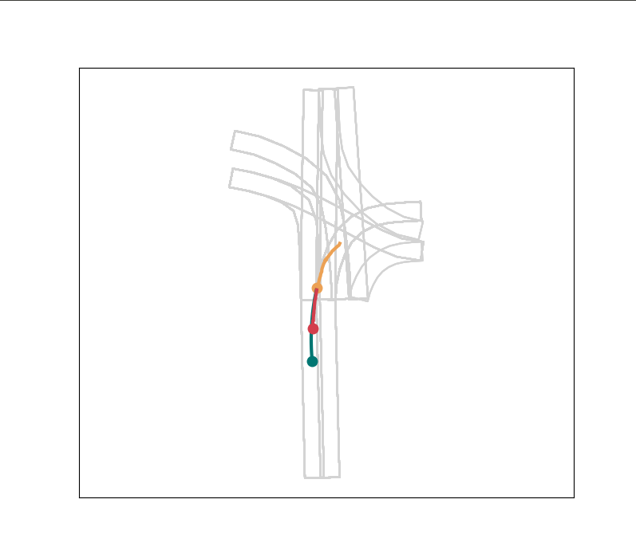
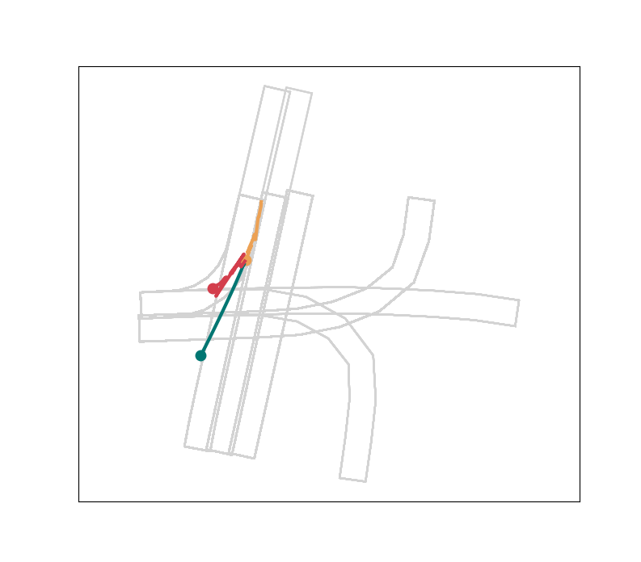
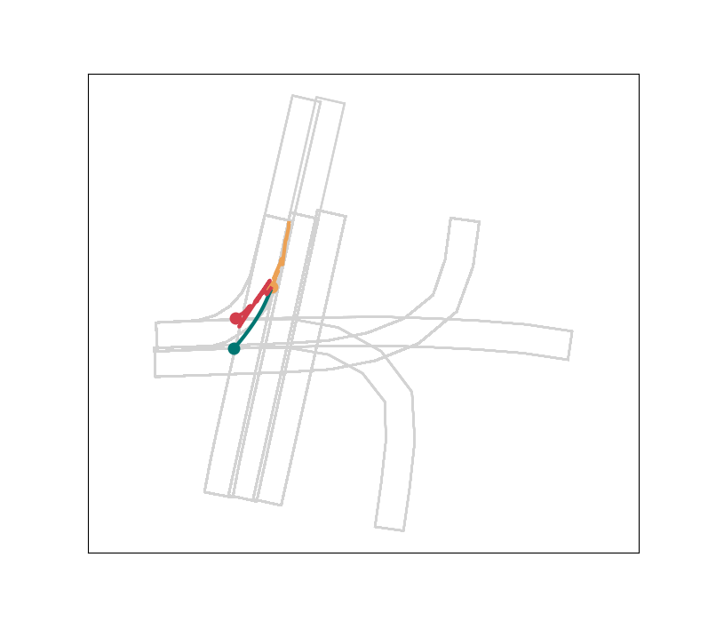
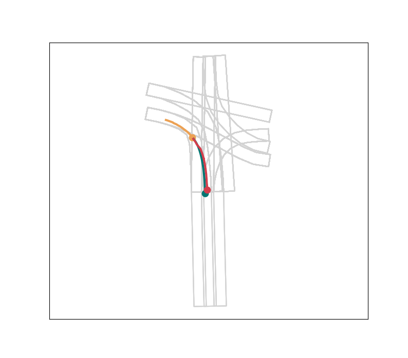

[](https://www.python.org/downloads/release/python-370/)

For installation of ARGOVERSE API: https://github.com/argoai/argoverse-api

For the base code referred to in this implementation: https://github.com/jagjeet-singh/argoverse-forecasting

For the pre-computed features: https://drive.google.com/drive/folders/1hHbpdlsgQL_XOxrUK0OuWGX0BxiGpxKY


#### Train Models:

The options available are lstm_train, GRU_train, rnn_train and GRU_linear_train.

Command to train:
```
$ python option_name.py --train_features <path/to/train/features> --val_features <path/to/val/features> --test_features <path/to/test/features> --model_path <path/to/saved/checkpoint> --use_map --use_delta --obs_len 20 --pred_len 30 --traj_save_path <pkl/file/for/forecasted/trajectories>
```

### 3) Metrics and visualization

#### Evaluation metrics

Here we compute the metric values for the given trajectories. Since ground truth trajectories for the test set have not been released, you can run the evaluation on the val set. If doing so, make sure you don't train any of the above baselines on val set.

Some examples:


Evaluating a model
```
python eval_forecasting_helper.py --metrics --gt <path/to/ground/truth/pkl/file> --forecast <path/to/forecasted/trajectories/pkl/file> --horizon 30 --obs_len 20 --miss_threshold 2 --features <path/to/test/features> --n_guesses_cl 1 --n_cl 9 --max_neighbors_cl 3
```


It will print out something like
```
------------------------------------------------
Prediction Horizon : 30, Max #guesses (K): 1
------------------------------------------------
minADE: 3.533317191869932
minFDE: 7.887520305278937
DAC: 0.8857479236783845
Miss Rate: 0.9290787402582446
------------------------------------------------
```

#### Visualization

Here we visualize the forecasted trajectories

```
python eval_forecasting_helper.py --viz --gt <path/to/ground/truth/pkl/file> --forecast <path/to/forecasted/trajectories/pkl/file> --horizon 30 --obs_len 20 --features <path/to/test/features>
```
Some sample results are shown below

| | |
|:-------------------------:|:-------------------------:|
|  |  |
|  |  |


---
